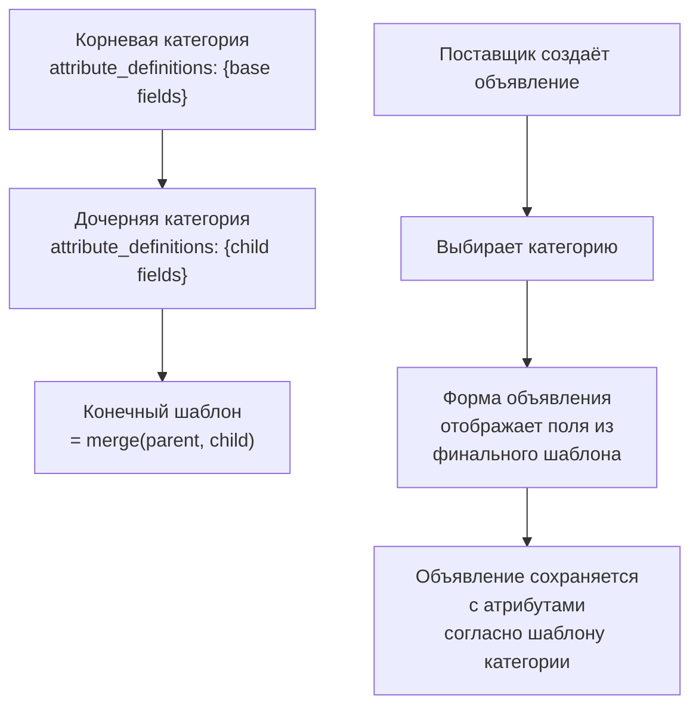

# Business Viewpoint: category

**Связанные документы:** Domain Model, User Scenarios, Personas, MVP Scope

---

## Business Meaning

Категория — это классификатор товара на маркетплейсе. Определяет, какие характеристики (атрибуты) товара будут заполнены в объявлении. Образует иерархическое дерево, где каждая дочерняя категория наследует и дополняет набор атрибутов родительской. Без категорий товары были бы неструктурированными — покупатель не смог бы фильтровать, а поставщик не знал бы, какие параметры указать. Категория — фундамент матчинга: объявления матчатся в том числе по категории и её динамическим атрибутам.

---

## Actor Expectations

| Актор (Persona) | Ожидание | Ключевые операции |
|-----------------|----------|-------------------|
| Поставщик (производитель комплектующих) | Выбрать правильную категорию для своего товара, чтобы объявление показывалось целевым покупателям | Выбор категории при создании объявления, просмотр иерархии дерева категорий |
| Закупщик (Инженер по закупкам) | Фильтровать объявления по категориям и их атрибутам, чтобы сузить поиск до релевантных товаров | Просмотр дерева категорий, фильтрация по категории, поиск по атрибутам категории |
| Менеджер по продажам (сбыт предприятия) | Видеть свои товары в правильных категориях с корректными атрибутами, чтобы получать целевые match-связки | Просмотр иерархии, валидация атрибутов товара под категорию |

---

## Lifecycle Expectations

| Этап (бизнес-состояние) | Бизнес-смысл | Ожидаемая длительность |
|-------------------------|-------------|----------------------|
| Черновик | Категория создаётся администратором, заполняются бизнес-атрибуты (name, jsonb_schema, parent), но категория ещё не доступна пользователям | До <!-- parameters: ads.category.draft_max_days --> 7 дней |
| Активна | Категория опубликована — доступна всем пользователям для выбора при создании объявления и для фильтрации поиска. Объявления в этой категории матчатся между собой | Постоянно, пока не отключена администратором |
| Отключена | Категория скрыта: старые объявления в ней видны, но новые объявления в эту категорию создать нельзя | Пока не будет повторно активирована |

---

## Visibility Semantics

| Актор | Видит сущность? | Условие |
|-------|----------------|---------|
| Поставщик | Да | Только активные категории при создании/редактировании объявления |
| Закупщик | Да | Только активные категории в фильтрах поиска |
| Менеджер по продажам | Да | Только активные категории при выборе для своих товаров |
| Администратор платформы | Да | Во всех состояниях (Черновик, Активна, Отключена) |

---

## Ownership Semantics

| Владелец (бизнес-роль) | Тип владения | Может передать? |
|------------------------|-------------|-----------------|
| Администратор платформы | Полное — создаёт, редактирует, отключает категории, управляет jsonb_schema и иерархией | Нет — владение неотчуждаемо, категории являются системным справочником платформы |
| Поставщик | Частичное — выбирает категорию для своего объявления, но не может менять саму категорию или её атрибуты | Нет |

> **Пояснение:** В бизнес-смысле категория — «словарь» платформы (owns-by-system). Владелец (администратор) управляет иерархией и схемой атрибутов. Пользователи (поставщики) только выбирают категории из доступного списка.

---

## Capability Expectations

| Возможность | Описание | Источник (US) |
|-------------|----------|---------------|
| Просмотр дерева категорий | Все пользователи видят иерархическое дерево категорий для выбора/фильтрации | US-XXX |
| Выбор категории при создании объявления | Поставщик выбирает категорию товара, после чего в форме объявления появляются атрибуты, определённые шаблоном категории (attribute_definitions, с учётом наследования от родителя) | US-XXX |
| Фильтрация объявлений по категории | Закупщик сужает поиск, выбирая категорию и её атрибуты в фильтрах | US-XXX |
| Создание / редактирование категории | Администратор создаёт новую категорию, задаёт name, parent (для иерархии), attribute_definitions (шаблон характеристик товара) | US-XXX |
| Отключение категории | Администратор отключает категорию — новые объявления в неё не создаются, существующие остаются видимыми | US-XXX |

> **Примечание:** Номера User Scenarios (US-XXX) будут проставлены после создания domain-model и use-case документов для ads/category.

---

## Бизнес-атрибуты сущности category

| Атрибут | Описание | Наследуется? |
|---------|----------|-------------|
| **name** | Название категории. Отображается в дереве категорий и в фильтрах. Пример: «Фланцы», «Крепёжные изделия» | Нет — уникальное для каждой категории |
| **parent** | Ссылка на родительскую категорию. Формирует иерархическое дерево. Если parent = null — категория корневая | Нет — задаётся при создании |
| **attribute_definitions** | Шаблон атрибутов товара (массив определений): какие характеристики заполняет поставщик в объявлении, их типы (string/number/boolean), обязательность, правила валидации и эталонные единицы измерения. Каждый элемент маппится на поле attributes[] агрегата ad | Да — категория наследует шаблон родителя (merge: новые атрибуты добавляются, существующие могут быть переопределены, но не удалены) |

### Механизм наследования

### Правила

1. **Иерархия:** Категории образуют дерево (один parent на категорию). Глубина вложенности — не ограничена.
2. **Наследование attribute_definitions:** Конечный шаблон атрибутов для категории = `merge(parent.attribute_definitions, own.attribute_definitions)`. Если родитель определяет атрибут с данным `name`, дочерняя категория может его переопределить (override), но не удалить.
3. **Использование в объявлении:** При создании объявления поставщик выбирает категорию → система отображает поля согласно финальному (с учётом наследования) шаблону атрибутов → поставщик заполняет характеристики → они сохраняются как `attributes[]` в агрегате ad.
4. **Фильтрация поиска:** Покупатель может фильтровать объявления по категории и по атрибутам, определённым в шаблоне данной категории (с учётом наследования).
